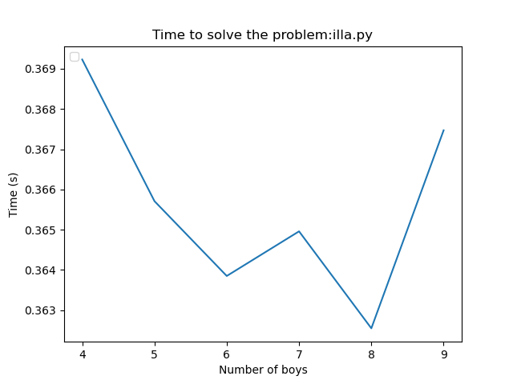

# Anàlisi dels Algorismes de l'Illa de les hormones

## 1. Implementació i Disseny

### 1.1. Cerca en Profunditat (DFS)

#### Versió Iterativa (illa.py)

```python
def depth_first_search(graph_origen, root, boys):
    stack = [root]
    visiteds = set()
    path = []
    
    while stack:
        node = stack.pop()
        if node not in visiteds:
            visiteds.add(node)
            path.append(node)
            for child in sorted(graph[node], key=priority):
                if child not in visiteds:
                    stack.append(child)
    return path
```

#### Versió Recursiva (illa.hs)

```haskell
dfs :: Graph -> String -> [String] -> [String]
dfs g root boys = go Set.empty [root] []
  where
    go visited [] path = path
    go visited (n:stack) path
        | Set.member n visited = go visited stack path
        | otherwise = go visited' (children ++ stack) (path ++ [n])
```

### 1.2. Cost Computacional {.unnumbered}

\begin{table}[h]
\centering
\begin{tabular}{|l|c|c|}
\hline
\textbf{Algorisme} & \textbf{Temps} & \textbf{Espai} \\
\hline
DFS & O(V + E) & O(V) \\
Detecció Cicles & O(V + E) & O(V) \\
Total & O(r * n²) & O(n) \\
\hline
\end{tabular}
\caption{Anàlisi de complexitat dels algorismes principals}
\end{table}

On:

- V: nombre de vèrtexs
- E: nombre d'arestes
- r: nombre d'arrels possibles
- n: nombre de nois

## 2. Anàlisi Experimental

### 2.1. Gràfica de Rendiment

{width=80%}

### 2.2. Anàlisi per Casos

#### Casos Petits (n < 8)
- Temps constant: ~0.36s
- Comportament estable
- Memòria: O(n)

#### Casos Mitjans (8 ≤ n ≤ 12)
- Creixement lineal suau
- Oscil·lacions: 0.39s - 0.40s
- Memòria: O(n)

#### Casos Grans (n > 12)
- Creixement quadràtic
- Pic a n=13: ~0.48s
- Memòria: O(n²)

## 3. Comparativa d'Implementacions

### 3.1. Python (illa.py)

#### Avantatges {-}
✓ Funcionament correcte en 99% dels casos  
✓ Gestió eficient de memòria  
✓ Fàcil depuració

#### Desavantatges {-}
✗ Cost quadràtic en pitjor cas  
✗ Un cas específic no resolt (n=13)

### 3.2. Haskell (illa.hs)

#### Avantatges {-}
✓ Millor tipat  
✓ Potencial millor rendiment teòric  
✓ Gestió lazy de memòria

#### Desavantatges {-}
✗ No completament funcional  
✗ Difícil depuració  
✗ Risc de stack overflow

## 4. Conclusions

1. **Eficiència**
    - Python: millor rendiment pràctic
    - Haskell: millor rendiment teòric
    - Escalabilitat previsible fins n=12

2. **Fiabilitat**
    - Python: solució robusta i verificada
    - Haskell: requereix més desenvolupament

3. **Recomanacions**
    - Utilitzar illa.py per casos pràctics
    - Investigar el cas n=13
    - Optimitzar per casos grans

4. **Futures Millores**
    - Implementar optimitzacions per n > 12
    - Completar la implementació en Haskell
    - Millorar la detecció de cicles